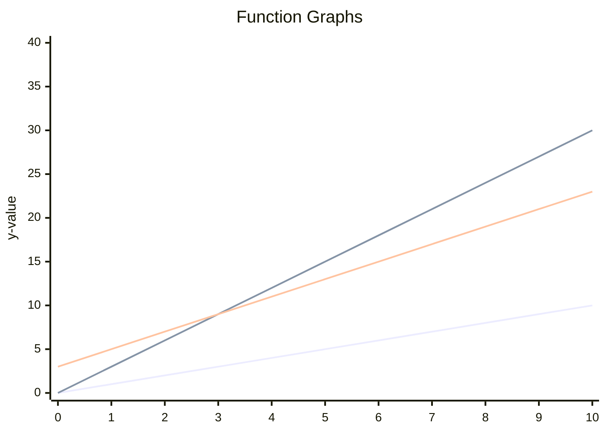

# Complexity

## Purpose

With concept of complexity, we can evaluate a solution.

## How?

### Math Concept

Complexity quantifies the maximum resources required to solve a problem or execute an algorithm, aiding in identifying efficient algorithms for optimal problem-solving by understanding the relationship between resource usage and input size; for example, the total time to create x books may be as follow:

Time(n) = 4n^3 + 4n^2 + 3

However, in real world problems, precise function to describe the total time of producing n amount of books does not exist at all, so we use **asymptotic notations**.

#### Asymptotic Notations

There are commonly used notations in computer science, such as big-O (O), big-theta (Θ), and big-omega (Ω), which are used to describe and analyze the time or space complexity of algorithms. For more detailed definitions and explanations of these notations, I recommend referring to reputable academic sources available online and we only focus on the definition of industry here.

The definition of **O** in industry is the same as the definition of **Θ** in academia; that is

$$
\Theta(g(n)) = \{ f(n) | \ \exists \ c_0, c_1, n_0 > 0 \ \forall n > n_0, \ s.t. \ 0 \leq c_0g(n) \leq f(n) \leq c_1g(n) \}
$$

Then f(n) is an element of $\Theta$ of g(n), which is what industry care about ($O$, big-O); for example, $2x + 100$ is an element of $\Theta(x)$; then we can use $x$ to describe the complexity of $2x + 100$. The following plot demonstrates that $2x + 100$ is wrapped by $$3x$$ and $$x$$ after $x > 3$



#### Notation Simplification

Based on the defination, we know that the big O of

* $2x + 100$ is $2x$ and also $x$
* $2x^2 + x$ is $x^2$ because of
  $$ \exists \ a, b > 0 \ s.t \ ax^2 < 2x^2 + x < bx^2 \ \forall x>0$$

That is, all the constant number can be ignored.

* $O(x + a) = O(x)$, where a is constant
* $O(x - a) = O(x)$, where a is constant
* $O(ax) = O(x)$, where a is constant
* $O(x/a) = O(x)$, where a is constant

### Time Complexity

Recap, the definition of big-O (O) in industry is the same as big-theta (Θ) in academia. The meaning of `Time complexity = O(n)` is that the time taken by the algorithm increases proportionally with the size of the input.

#### Amortized Time Complexity

In some data structures, individual operations may occasionally be expensive, but most are cheap. For example, appending to a dynamic array is usually $𝑂(1)$ but resizing the array when it’s full takes $𝑂(𝑛)$. To understand overall performance, we use amortized analysis, which averages the cost of a sequence of operations.

One method is the **accounting method**, where each operation is charged more than its actual cost, storing the extra as "credit" to pay for future expensive operations.

Example: Dynamic Array Resizing

Suppose we double the array size whenever it’s full. Most insertions are $𝑂(1)$ but resizing takes $𝑂(𝑛)$ to copy elements.

Over $n$ insertions:

Each element is copied at most once per doubling.

Total cost across $n$ insertions is $𝑂(𝑛)$.

Amortized cost per insertion is $𝑂(1)$.

So even though resizing is costly, the average cost per insert remains constant.

### space complexity

The meaning of `Space complexity = O(n)` is that the space taken by the algorithm increases proportionally with the size of the input.

### Examples

#### Iterative Binary Search

```javascript
function binarySearchIterative(array, target) {
  let low = 0;
  let high = array.length - 1;

  while (low <= high) {
    let mid = Math.floor((low + high) / 2);
    if (array[mid] === target) {
      return true;
    }
    if (target < array[mid]) {
       high = mid - 1;
    } else {
      low = mid + 1;
    }
  }

  return false;
}
```
* Time Complexity: $2^{step}$ = number of elements, meaning step = $log_{2}N = logN$; take 16 sorted elements as an example
  * Step 1: check middle of 16 → split to 8 & 8
  * Step 2: check middle of 8 → split to 4 & 4
  * Step 3: check middle of 4 → split to 2 & 2
  * Step 4: check middle of 2 → split to 1 & 1
  * Step 5: check single element → answer found
* Space Complexity
  * It only need to store low and high, so the space complexity is $O(1)$.

#### Recursive Binary Search

```javascript
function binarySearchRecursive(array, target, low = 0, high = array.length - 1) {
  if (low > high) return false;

  const mid = Math.floor((low + high) / 2);
  if (array[mid] === target) return true;

  if (target < array[mid]) {
    return binarySearchRecursive(array, target, low, mid - 1);
  } else {
    return binarySearchRecursive(array, target, mid + 1, high);
  }
}
```
* Time Complexity: $2^{step}$ = number of elements, meaning step = $log_{2}N = logN$; take 16 sorted elements as an example
  * Step 1: check middle of 16 → split to 8 & 8
  * Step 2: check middle of 8 → split to 4 & 4
  * Step 3: check middle of 4 → split to 2 & 2
  * Step 4: check middle of 2 → split to 1 & 1
  * Step 5: check single element → answer found
* Space Complexity
  * It need to store the stack of binarySearchRecursive, so the space complexity is also $logN$.

## Reference

cracking the coding interview
